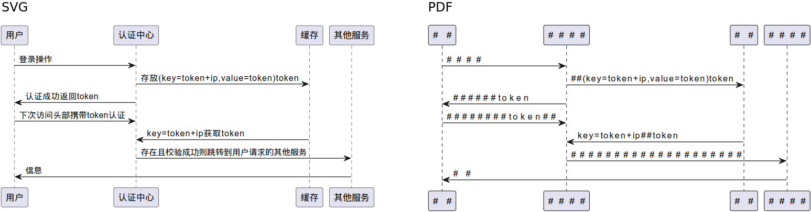

# SVG to PNG converter

Test Repository for [PlantUML Server Issue#283](https://github.com/plantuml/plantuml-server/issues/283).


## Get started

```bash
mvn clean install
mvn exec:exec
```

## Problem/Challenge



```
Jun 10, 2023 10:53:20 AM org.apache.fop.fonts.Typeface warnMissingGlyph
WARNING: Glyph 29992 (0x7528, ) not available in font Helvetica
Jun 10, 2023 10:53:20 AM org.apache.fop.fonts.Typeface warnMissingGlyph
WARNING: Glyph 25143 (0x6237, ) not available in font Helvetica
Jun 10, 2023 10:53:20 AM org.apache.fop.fonts.Typeface warnMissingGlyph
WARNING: Glyph 35748 (0x8ba4, ) not available in font Helvetica
Jun 10, 2023 10:53:20 AM org.apache.fop.fonts.Typeface warnMissingGlyph
WARNING: Glyph 35777 (0x8bc1, ) not available in font Helvetica
Jun 10, 2023 10:53:20 AM org.apache.fop.fonts.Typeface warnMissingGlyph
WARNING: Glyph 20013 (0x4e2d, ) not available in font Helvetica
Jun 10, 2023 10:53:20 AM org.apache.fop.fonts.Typeface warnMissingGlyph
WARNING: Glyph 24515 (0x5fc3, ) not available in font Helvetica
Jun 10, 2023 10:53:20 AM org.apache.fop.fonts.Typeface warnMissingGlyph
WARNING: Glyph 32531 (0x7f13, ) not available in font Helvetica
Jun 10, 2023 10:53:20 AM org.apache.fop.fonts.Typeface warnMissingGlyph
WARNING: Many requested glyphs are not available in font Helvetica
```
